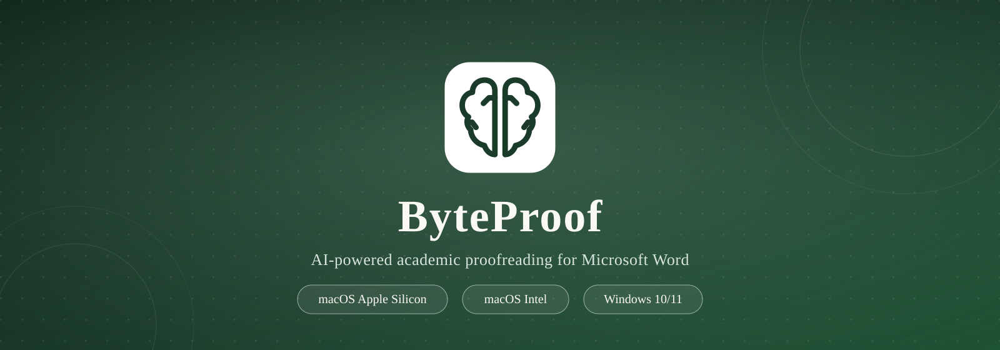

<p align="center">
  
</p>

<p align="center">
  <a href="https://github.com/michael-zumba/ByteProof/releases"></a>
  <a href="#get-byteproof"></a>
  <a href="#local-ai"></a>
  <a href="LICENSE"></a>
</p>

<p align="center">
  <b>ByteProof</b> is a desktop proofreading app for academics and writers.
  It reads your document with state-of-the-art AI, then rewrites with tracked
  changes in Microsoft Word — or polishes text in any other app on your Mac
  or PC.
</p>

<p align="center">
  <a href="#overview">Overview</a> ·
  <a href="#features">Features</a> ·
  <a href="#how-it-works">How it works</a> ·
  <a href="#get-byteproof">Get ByteProof</a> ·
  <a href="#documentation">Documentation</a> ·
  <a href="#development">Development</a> ·
  <a href="#license">License</a>
</p>

---

## Overview

ByteProof combines powerful AI models with a carefully designed desktop
experience. It works in two seamless modes:

- **Microsoft Word** — academic proofreading with tracked changes, reviewer
  comments, citation/math protection, and context-aware editing styles.
- **Any other app** — email drafts, browsers, editors, and chat windows get
  writing polish that replaces your selection with the final, polished text.
  ByteProof reads the surrounding context so tone, references, and agreement
  are resolved accurately.

Mode is detected automatically: if Word is in front, you get tracked changes;
anywhere else you get polished final text. Global hotkeys work everywhere on
macOS and Windows.

## Features

<table>
  <tr>
    <td align="center" width="25%"><b>✍️ Tracked changes</b><br/><small>Professional revisions inside Microsoft Word</small></td>
    <td align="center" width="25%"><b>💬 Reviewer comments</b><br/><small>Context-aware technical &amp; language feedback</small></td>
    <td align="center" width="25%"><b>🖊️ Polish anywhere</b><br/><small>Email, browsers, editors &amp; chat windows</small></td>
    <td align="center" width="25%"><b>⌨️ Global hotkeys</b><br/><small>One keystroke in any application</small></td>
  </tr>
  <tr>
    <td align="center"><b>🧠 Private local AI</b><br/><small>Offline, no account, runs on your own machine</small></td>
    <td align="center"><b>🔑 Bring your own key</b><br/><small>DeepSeek, OpenAI, Anthropic, Google, xAI, Groq, Perplexity</small></td>
    <td align="center"><b>📚 Citation &amp; math protection</b><br/><small>References and equations stay untouched</small></td>
    <td align="center"><b>🎯 Context-aware styles</b><br/><small>Thesis, journal, general &amp; creative writing</small></td>
  </tr>
</table>

## How it works

ByteProof detects what you're doing and adapts automatically.

| Where you are | What you get |
|---|---|
| **Microsoft Word** (in front) | Academic proofreading with tracked changes and reviewer comments, protected citations and maths |
| **Any other app** | Polished replacement text, with surrounding context included for accurate tone and references |

The hybrid AI engine gives every user a working proofreader out of the box:

### Local AI

ByteProof downloads a small, open-weights model (Qwen3 / Phi-4 Mini) and runs
it **privately on your computer** through llama.cpp — offline, no account, no
API key. The app picks the right model for your hardware:

- **8–16 GB RAM** → Phi-4 Mini (~2.3 GB)
- **16 GB+** → Qwen3 8B (~5 GB) or Qwen3 14B (~9 GB)
- **Older 6 GB machines** → Qwen3 1.7B (~1.2 GB), with Qwen3 4B for
  general/multilingual use

Downloads resume, are verified with SHA-256, and can be managed from
Settings → Local AI.

### Bring your own key

For maximum quality or context, connect DeepSeek, OpenAI, Anthropic, Google,
xAI, Groq, Perplexity, or your own Ollama server.

## Get ByteProof

<p align="center">
  <a href="https://github.com/michael-zumba/ByteProof/releases/latest/download/ByteProof_Installer_AppleSilicon.dmg"></a>
  <a href="https://github.com/michael-zumba/ByteProof/releases/latest/download/ByteProof_Installer_Intel.dmg"></a>
  <a href="https://github.com/michael-zumba/ByteProof/releases/latest/download/ByteProof_Windows.zip"></a>
</p>

<p align="center">
  <b>7-day free trial</b> — every feature, no credit card.<br/>
  After the trial: limited free mode (Local AI, 3 proofreads/day) or a
  <b>one-time $35 NZD license</b> for up to 2 computers.
</p>

### macOS

1. Download the installer for your chip (Apple Silicon or Intel).
2. Open the `.dmg` and drag **ByteProof** to Applications.
3. Grant Accessibility permission when prompted — required for hotkeys and
   Word integration.

### Windows

1. Download `ByteProof_Windows.zip`.
2. Extract the zip and run `ByteProof.exe`.

No special Windows permissions are required for hotkeys or Word integration.

## Documentation

- [Release & distribution guide](GITHUB_DISTRIBUTION_GUIDE.md)
- [Product page](https://www.bytemind.co.nz/byteproof.html)
- [Local model training](training/README.md)
- [Activation server](server/README.md)

## Development

### Prerequisites

- Python 3.11+
- macOS (tested on Sequoia/Sonoma) or Windows 10/11
- `create-dmg` (`brew install create-dmg`) for macOS installers

### Setup

```bash
git clone https://github.com/michael-zumba/ByteProof.git
cd ByteProof
python3 -m venv venv
source venv/bin/activate   # Windows: venv\Scripts\activate
pip install -r requirements.txt
python run.py
```

### Releases

Shipping a new version is a single command from macOS:

```bash
./scripts/release.sh 1.6.0 "Short release notes for users"
```

The script bumps the version everywhere, pushes a tag so GitHub Actions builds
the Windows package in parallel, builds the Apple Silicon and Intel DMGs
locally, uploads everything to a GitHub Release, and publishes the update feed
to the ByteMind website. See the
[release guide](GITHUB_DISTRIBUTION_GUIDE.md) for details.

## License

This software is proprietary. See [LICENSE](LICENSE) for details.

---

<p align="center">
  <small>Built with Python &amp; PyQt6 · © 2026 ByteMind Ltd</small>
</p>
