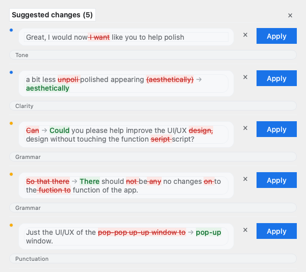
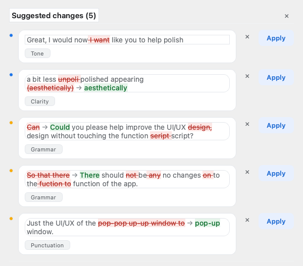

# Suggestion panel polish — Evidence

## 1. What the owner's screenshot showed

`SCR-20260930-ipnz.png` (inspect in chat): five suggestions, and in this
order down the panel — a full-width grey "Tone" bar, a card, a "Clarity" bar,
a card, "Grammar", a card, "Grammar", a card, "Punctuation", a card. Every row
carried a filled blue Apply, and "Apply all" (same blue) sat bottom-left. The
severity dot floated in the left gutter. Long red strikethrough runs dominated
rows 3–4, and row 2's arrow wrapped to the next line alone.

## 2. Failing tests first (RED)

```
$ venv/bin/python -m pytest tests/test_live_preview.py -k \
  "popup_diff_gets or category_tag_sits or row_apply_is_tonal" -q
FAILED test_the_popup_diff_gets_its_own_style_and_the_review_view_keeps_its
FAILED test_the_category_tag_sits_inside_its_suggestion_card
FAILED test_the_row_apply_is_tonal_and_apply_all_is_the_primary
3 failed, 146 deselected
```

Each failed for its own missing piece: no `panel_style` spelling in
`diff_html`, the tag's parent was a plain `QWidget` outside the card frame,
and `TONAL_BUTTON` did not exist (ImportError).

## 3. The contract the tests now hold

```
diff_html(before, after)                    review view: #C5221F, plain " → "
diff_html(before, after, panel_style=True)  panel: #B3261E, "\u00a0→\u00a0"

suggestion card: the category tag's parent is the card QFrame that also
                 holds the diff label (one visual unit per suggestion)

row Apply button  -> TONAL_BUTTON   (light fill, blue text)
Apply all button  -> PRIMARY_BUTTON (the panel's only filled primary)
```

## 4. Before and after

Rendered offscreen at the same size from the same synthetic content (no user
text), HEAD code for `before.png` and the shipped code for `after.png`:





What to look at: the grey bars became tags inside their cards; the only filled
blue is "Apply all", now right-aligned; row Apply buttons are tonal; the
severity dots sit on their card's first line; the arrows stay glued to both
words.

## 5. The gate

```
$ venv/bin/python -m ruff check src tests
All checks passed!
$ venv/bin/python scripts/check_version.py
version markers agree: 2.2.2-beta.6 (tuple (2, 2, 2, 6))
$ BYTEPROOF_CI_PROGRESS=1 venv/bin/python scripts/run_tests_ci.py tests/test_*.py
============================= 194 passed in 38.46s =============================
============================= 149 passed in 2.48s ==============================
============================= 110 passed in 14.04s =============================
All test files passed.
```

`tests/test_live_preview.py` went from 146 to 149 tests (3 new, red first).
The panel can also be rendered offscreen for a look:

```
$ QT_QPA_PLATFORM=offscreen venv/bin/python - <<'PY'   # list, single, clean
from src.live_overlay import WordSuggestionCard
card = WordSuggestionCard(); card.set_spans(spans); ... card.grab().save(...)
PY
```

## 6. Build and install record

```
$ ./build_macos.sh
Build complete! Installer: ByteProof_Installer_AppleSilicon.dmg
Architecture: arm64
notarytool: id f0553bd6-213b-4bb1-8439-2d9637c15e36 status: Accepted
stapler: The staple and validate action worked!

2.2.2-beta.5 (installed) -> previous-versions/ByteProof_2.2.2-beta.5.app
$ ditto dist/ByteProof.app /Applications/ByteProof.app
$ defaults read /Applications/ByteProof.app/Contents/Info.plist CFBundleShortVersionString
2.2.2-beta.6
$ codesign --verify --deep --strict /Applications/ByteProof.app
signature ok
$ open -a /Applications/ByteProof.app
"LIVE PERMISSION: trusted=True app='ByteProof'"
```

The public update feed is untouched (pre-release bump skips it by design).

## 7. Limits and follow-ups

* The offscreen renders warn about a substituted "Sans Serif" in the headless
  environment, so wrapped-line heights there are approximate; the owner's real
  screen is the ground truth for text flow.
* Focus-visible styling is deliberately absent: the panel is
  `WindowDoesNotAcceptFocus`, so keyboard focus never lands on it. If that
  ever changes, add focus rings to the tonal and primary buttons.
* No behaviour was touched, so the next log check should look exactly like the
  previous one (apply/undo paths unchanged) apart from the panel's pixels.
